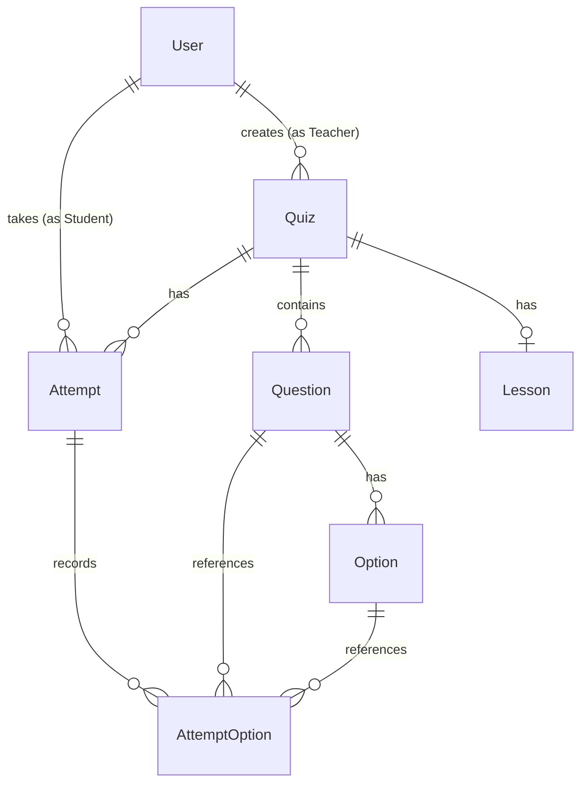

# Quiz App Backend API

A robust, progressive, and scalable server-side application for a Quiz & Lesson management platform. Built with **NestJS**, **Prisma ORM**, and **PostgreSQL**, this backend manages role-based access for Teachers and Students, email-based activation, interactive quizzes, automated grading, and PowerPoint-supported lessons.

---

## 🚀 Key Features

*   **Role-Based Access Control**: Separate privileges for `TEACHER` and `STUDENT` roles.
*   **Authentication & Verification**: Sign-in, registration, token verification, and verification emails powered by SMTP.
*   **Interactive Quizzes**:
    *   Teachers can CRUD quizzes and manage their associated questions/options.
    *   Students can view quizzes, take interactive attempts, submit answers, and receive automated real-time scores.
*   **PowerPoint-Supported Lessons**:
    *   Attach YouTube video links and slide presentations to quizzes.
    *   Allows uploading PowerPoint files (`.ppt`, `.pptx`), stored and dynamically served.
*   **Database Cascade Operations**: Automatically cleans up questions and options when their associated quizzes are deleted.

---

## 🛠 Tech Stack

*   **Framework**: [NestJS](https://nestjs.com/) (TypeScript)
*   **Database ORM**: [Prisma Client](https://www.prisma.io/)
*   **Database**: PostgreSQL
*   **File Uploads**: Multer
*   **Mail Delivery**: `@nestjs-modules/mailer` (using SMTP / NodeMailer)
*   **Validation**: `class-validator` & `class-transformer`
*   **Package Manager**: Yarn

---

## 📋 Prerequisites

Before running the application, make sure you have:
*   [Node.js](https://nodejs.org/) (version 18 or above recommended)
*   [Yarn](https://yarnpkg.com/)
*   A running [PostgreSQL](https://www.postgresql.org/) database
*   SMTP Server Credentials (e.g., Google App Password for Gmail integration)

---

## ⚙️ Configuration & Installation

### 1. Clone & Install Dependencies
First, install the package dependencies using Yarn:
```bash
yarn install
```

### 2. Configure Environment Variables
Create a `.env` file in the root directory (based on `.env.example` or the template below) and specify your local setup properties:
```env
PORT=7878
DATABASE_URL="postgresql://<db_username>:<db_password>@<db_host>:<db_port>/<db_name>?schema=public"

SMTP_API_SERVER=smtp.gmail.com
SMTP_API_USERNAME=your_gmail_address@gmail.com
SMTP_API_PASSWORD=your_gmail_app_password
SMTP_API_PORT=587
```

### 3. Setup the Database
Sync your PostgreSQL database schema with your Prisma models and generate the Prisma Client:
```bash
# Push the schema changes directly to the database
npx prisma db push

# Generate the prisma client
npx prisma generate
```

---

## 🏃 Run the Application

```bash
# Start development mode (with hot-reloading)
yarn start:dev

# Start debug mode
yarn start:debug

# Build & run in production
yarn build
yarn start:prod
```

The API server will listen on the port specified in your `.env` file (defaults to `7878` or `3000`).

---

## 📂 Database Schema Overview

The database models are configured in [schema.prisma](file:///Users/defiveninth/Documents/quiz-app-back/prisma/schema.prisma):



*   **User**: Represents teachers and students. Roles: `TEACHER`, `STUDENT`.
*   **Quiz**: Core quiz metadata (Title, Description). Created by teachers.
*   **Question**: Individual quiz questions.
*   **Option**: Multiple-choice answers for questions, labeled with `isCorrect` flags.
*   **Lesson**: Optional learning material tied to a Quiz containing a description, YouTube link, and PowerPoint files.
*   **Attempt**: Tracking record of a Student taking a Quiz, storing their final calculated `score`.
*   **AttemptOption**: Map of questions, selected options, and attempts.

---

## 📡 API Endpoints Reference

> [!NOTE]
> For simplicity and client integration convenience, this API passes the authentication `accessToken` directly in the HTTP Request **Body** rather than utilizing header guards.

### 🔑 Authentication (`/auth`)

#### Create Account
*   **POST** `/auth/create-account`
*   *Payload*: `{ "email": string, "role": "TEACHER" | "STUDENT" }`
*   *Action*: Creates a user with a validation token and sends an activation email.

#### Verify Account / Password Activation
*   **POST** `/auth/verify-account`
*   *Payload*: `{ "verifyToken": string, "newPassword": string, "firstName": string, "surname": string }`
*   *Action*: Activates the user's password and profile name, updating status.

#### Verify Token
*   **POST** `/auth/verify-token`
*   *Payload*: `{ "verifyToken": string }`
*   *Action*: Checks validity of verification/activation tokens.

#### Sign In
*   **POST** `/auth/sign-in`
*   *Payload*: `{ "email": string, "password": string }`
*   *Response*: Returns the authentication `accessToken` (token) and user details.

#### Get Info
*   **POST** `/auth/get-info`
*   *Payload*: `{ "accessToken": string }`
*   *Response*: Current profile details of the user.

---

### 📝 Quizzes (`/quiz`)

#### Get All Quizzes
*   **GET** `/quiz`
*   *Response*: List of all quizzes, including their questions and lessons.

#### Get Single Quiz
*   **GET** `/quiz/:id`
*   *Response*: Single quiz details filtered by ID.

#### Create Quiz
*   **POST** `/quiz/create`
*   *Payload*: `{ "accessToken": string, "title": string, "description": string }`
*   *Restriction*: Accessible by `TEACHER` accounts only.

#### Update Quiz
*   **PUT** `/quiz/:id`
*   *Payload*: `{ "accessToken": string, "title": string, "description": string }`

#### Delete Quiz
*   **DELETE** `/quiz`
*   *Payload*: `{ "accessToken": string, "quizId": string }`

#### Submit Quiz Attempt
*   **POST** `/quiz/submit`
*   *Payload*:
    ```json
    {
      "attemptId": "string",
      "answers": [
        { "questionId": "string", "optionId": "string" }
      ]
    }
    ```
*   *Response*: Calculated score. Writes attempt records to the database.

#### Get Single Quiz Results
*   **POST** `/quiz/results`
*   *Payload*: `{ "quizId": string }`

#### Get My Quizzes
*   **POST** `/quiz/mine`
*   *Payload*: `{ "accessToken": string }`

---

### ❓ Questions (`/questions`)

#### Create Question
*   **POST** `/questions`
*   *Payload*:
    ```json
    {
      "text": "Question Text",
      "quizId": "quiz-cuid-id",
      "options": [
        { "text": "Correct Option", "isCorrect": true },
        { "text": "Wrong Option", "isCorrect": false }
      ]
    }
    ```

#### Get All Questions
*   **GET** `/questions`

#### Get Question by ID
*   **GET** `/questions/:id`

#### Update Question
*   **PUT** `/questions/:id`
*   *Payload*:
    ```json
    {
      "text": "Updated Question Text",
      "options": [
        { "id": "optional-existing-option-id", "text": "Option Text", "isCorrect": true }
      ]
    }
    ```

#### Delete Question
*   **DELETE** `/questions/:id`

---

### 📖 Lessons (`/lesson`)

#### Edit Lesson Content
*   **POST** `/lesson/edit`
*   *Payload*: `{ "id": string, "title": string, "description": string, "ytVideoUrl": string }`

#### Add Presentation File to Lesson
*   **POST** `/lesson/add-file`
*   *Form-Data Body*:
    *   `lessonId`: `string`
    *   `file`: (Multipart PowerPoint file, allowed extensions: `.ppt`, `.pptx`)

#### Get Lesson File Paths
*   **GET** `/lesson/:lessonId/files`
*   *Response*: Array of file access endpoints for the specified lesson.

#### Get Specific Lesson File
*   **GET** `/lesson/:lessonId/files/:filename`
*   *Response*: Returns download path metadata.

---

### 📈 Attempts (`/attempt`)

#### Get Attempt Details
*   **GET** `/attempt/:id`

#### Create Attempt
*   **POST** `/attempt/create`
*   *Payload*: `{ "accessToken": string, "quizId": string }`
*   *Restriction*: Accessible by `STUDENT` accounts only.

#### Get My Attempts
*   **POST** `/attempt/get-mine`
*   *Payload*: `{ "accessToken": string }`
*   *Restriction*: Accessible by `STUDENT` accounts only.
